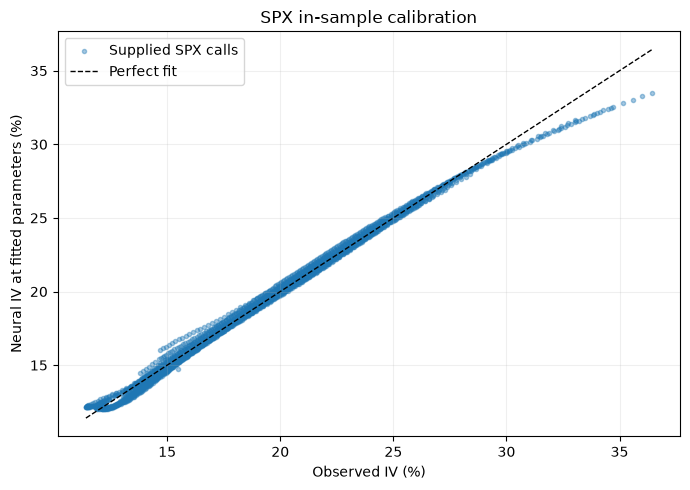

# Heston Calibration with Neural Networks

An end-to-end Python project calibrating the Heston stochastic volatility model to
SPX option quotes using a PyTorch implied-volatility surrogate and SciPy optimisation.
The trained checkpoint and executed notebook are included: no retraining is needed.

## Motivation

Direct Heston IV evaluation requires numerical integration of the characteristic
function followed by a scalar root solve for implied volatility. The trained
PyTorch surrogate replaces both steps with a single neural-network forward pass.
Offline label generation and training are separate from online inference time.

## Approach

1. Price European calls using the stable Heston characteristic function.
2. Invert Black–Scholes with `scipy.optimize.brentq`.
3. Generate 50,000 valid synthetic observations with a fixed seed.
4. Train a seven-input PyTorch surrogate for log implied volatility.
5. Fit five Heston parameters with SciPy L-BFGS-B and box constraints.
6. Apply the fit to mids of a supplied snapshot of SPX option quotes.

The scalar reference uses adaptive integration over `[0, infinity)`.
Training uses vectorised Gauss-Legendre integration of the **same** P1/P2 formula,
checked at 384/400 and 768/800 nodes/cutoff. Every accepted label uses Brent IV
inversion. Unstable or low-vega labels are rejected rather than clipped.

## Model

Under the risk-neutral measure:

$$dS_t=(r-q)S_tdt+\sqrt{v_t}S_tdW_t^S,$$
$$dv_t=\kappa(\theta-v_t)dt+\xi\sqrt{v_t}dW_t^v,\quad d\langle W^S,W^v\rangle_t=\rho dt.$$

| Parameter | Meaning | Training and calibration bounds |
|---|---|---|
| `kappa` | Mean-reversion speed | 0.1–5.0 |
| `theta` | Long-run variance | 0.005–0.15 |
| `xi` | Volatility of variance | 0.05–1.5 |
| `rho` | Spot/variance correlation | −0.95–−0.05 |
| `v0` | Initial variance | 0.005–0.15 |

The call price is `S exp(-qT) P1 - K exp(-rT) P2`, with P1/P2 obtained from CF
integrals. The stable square-root formulation uses a decaying exponential,
rationalisation, `log1p` and `expm1`. Numerical tolerances still apply.

## Neural Surrogate

Exactly seven inputs: `(kappa, theta, xi, rho, v0, K/S, T)`.
Architecture: `7 → 128 → 128 → 128 → 1`, tanh hidden layers, log-IV output.
Exponentiation produces positive decimal IV; one IV basis point is `0.0001`.

Input means and standard deviations are fitted only on the 40,000 training rows.
There are 5,000 validation and 5,000 test rows. Adam, mini-batches, MSE in log-IV
and validation early stopping use seed 42. The run completed 600 epochs; epoch 594
was restored before evaluating the test set. PyTorch uses float64 so SciPy's small
finite-difference perturbations remain observable. The single `.pt` state dictionary
includes scaler buffers, domain and training metrics; loading uses `weights_only=True`.

Moneyness is uniform on `[0.8,1.2]`; maturity is log-uniform on `[0.1,2.0]` years.
This focuses the experiment and avoids extrapolation at extreme strikes or very
short maturities. Carry is fixed at `r=0.045`, `q=0.012` in labels and market IVs.
Changing carry requires regenerating labels and retraining: it is not an extra input.

## Calibration

Minimise mean squared error between neural IV and observed mid-price IV.
`scipy.optimize.minimize(method="L-BFGS-B")` uses one starting point, finite
differences and the training parameter bounds. A linear unit-box rescaling balances
parameter units. No analytic network Jacobian is supplied.

The notebook first recovers a known synthetic surface (fit RMSE **2.61 IV bp**),
then fits **2,130 SPX calls across 14 maturities**. Market calibration converged in
30 iterations, taking 0.867 s in the recorded run, with MSE `1.49766e-5`.

| Parameter | SPX estimate |
|---|---:|
| kappa | 4.712692 |
| theta | 0.049075 |
| xi | 1.500000 |
| rho | −0.773514 |
| v0 | 0.037475 |

`xi` reaches its upper bound: this is an optimum within the trained box, not an
unrestricted optimum. The Feller margin `2*kappa*theta-xi**2` is **−1.78745**.
Feller positivity is reported, not constrained; its failure does not invalidate pricing.

## Results

| Measurement | Recorded result |
|---|---:|
| Synthetic test MAE / RMSE | **6.33 / 8.86 IV bp** |
| Synthetic test maximum error | 108.92 IV bp |
| SPX in-sample MAE / RMSE | **27.89 / 38.70 IV bp** |
| Adaptive Heston + Brent, per option | **7.37118 ms** |
| PyTorch IV, per option in a 200-option batch | **0.00237440 ms** |
| Measured IV evaluation speedup | **3,104×** |
| Benchmark prediction MAE / RMSE | 3.80 / 4.80 IV bp |
| Label generation / training | 9.83 / 78.63 s |

Primary timing comes from the standalone `scripts/benchmark.py` run. The same
benchmark inside Jupyter measured **3,978×** (9.48586 / 0.00238458 ms per option).
Both are retained to show run-to-run variability; the smaller standalone result is
used above. These are CPU batch-throughput measurements, **not full calibration
speedups or isolated-request latencies**. Scaling, tensor conversion, exponentiation
and NumPy output conversion are included; training and checkpoint loading are excluded.
The benchmark warms up, then uses three reference repetitions and nine groups of
100 neural batches, reporting median times on the same 200 seeded options.

A separate 30-quote check at the SPX fitted parameters gives numerical Heston versus
market RMSE **60.53 IV bp**, and neural versus numerical RMSE **9.85 IV bp**.
This subset differs from the full market set; surrogate fit and direct model fit
are distinct measurements. See the executed notebook for outputs and parameters.

Validation: **10 tests passed in 1.82 s; all 11 notebook code cells executed without
errors.** Results were produced in the supplied local macOS arm64 CPU run with one
PyTorch thread: Python 3.14.4, NumPy 2.5.3, SciPy 1.18.1, pandas 2.3.3,
PyTorch 2.14.1, Matplotlib 3.11.2, pytest 9.1.1. This is the recorded environment,
not a claim of identical timings or bitwise training results on other platforms.

## Example Result



## Repository Structure

| Path | Purpose |
|---|---|
| `src/black_scholes.py` | Call pricing and Brent inversion |
| `src/heston.py` | Stable CF and numerical integration |
| `src/data.py` | Synthetic labels and SPX cleaning |
| `src/neural_network.py` | PyTorch training, prediction and checkpoint |
| `src/calibration.py` | Five-parameter SciPy optimisation |
| `scripts/train_model.py` | Optional label regeneration and training |
| `scripts/benchmark.py` | Repeated CPU IV throughput comparison |
| `notebooks/heston_calibration.ipynb` | Executed six-section walkthrough |
| `tests/test_core.py` | Ten focused numerical and pipeline tests |
| `data/spx_options.csv` | Minimal supplied quotes; assumptions in `data/README.md` |
| `models/heston_nn.pt` | Trained PyTorch checkpoint |

## Quick Start

From the extracted repository root, in a Python environment with the dependencies:

```bash
python -m pip install -r requirements.txt
pytest -q
python scripts/benchmark.py
jupyter notebook notebooks/heston_calibration.ipynb
```

Optional full retraining: `python scripts/train_model.py` (overwrites the checkpoint).
To rerun the notebook non-interactively:

```bash
jupyter nbconvert --to notebook --execute notebooks/heston_calibration.ipynb --inplace
```

## Limitations

- The market fit is in-sample under assumed carry and supplied maturity conventions;
  the snapshot date is inconsistent across source materials (see `data/README.md`).
- The SPX optimum hits the `xi` bound. Expanding it requires new labels and retraining.
- Label rejection means measured synthetic accuracy describes accepted observations,
  not a uniform error guarantee throughout the training box.
- The neural surface is not constrained to be arbitrage-free; parameters need not be unique.
- Speedup depends on hardware, batch size and the chosen numerical reference.

The numerical core is a simplification of the main supplied project. The reference
archive supplied the SPX quotes and inspiration for a linear seven-input workflow.
